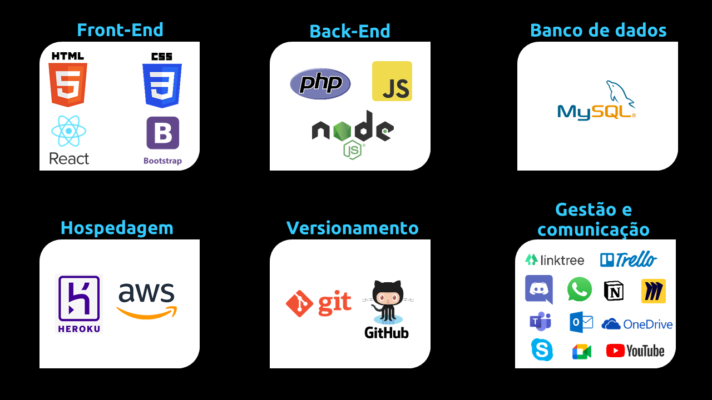

 

      
      <h3 align="center">EduImpulso </h3>

  <a href ="#rocket-o-projeto"> Projeto </a>  • 
  <a href ="#dart-proposta"> Proposta </a>  • 
  <a href ="#hourglass_flowing_sand-planejamento-de-entregas"> Planejamento </a>  • 
  <a href ="#calendar-as-sprints"> Sprints </a>  • 
  <a href ="#computer-tecnologias-utilizadas"> Tecnologias </a>  • 
  <a href ="#bulb-metodologia-utilizada"> Metodologia </a>  • 
  <a href ="#bar_chart-backlog-do-projeto"> Backlog </a>  •
  <a href ="#mortar_board-equipe"> Equipe </a> 

<h1 align="center">
  Projeto desenvolvido entre 2020 e 2021 pela Squad 04 (SPT-01) da Recode Pro 2020.
<h1 align="center">
 

## :rocket: O Projeto
 * O objetivo da plataforma EduImpulso é ajudar pessoas a encontrarem carreiras compatíveis com sua personalidade e talentos.

Através de informações imparciais e um quiz como ferramenta básica de autoconhecimento, sugerimos os possíveis cursos técnicos gratuitos para o estudante iniciar sua trajetória profissional.

A plataforma também conta com outras páginas, como: detalhamento das carreiras/médias salariais, notícias inspiradoras sobre educação e sugestão de cursinhos preparatórios na região.

Utilizando a metodologia ágil e tecnologias como Javascript, React, React Native, NodeJS e MySQL, o projeto foi desenvolvido em seis meses por uma squad de cinco pessoas.

## :dart: Proposta
 **Desenvolver uma plataforma de orientação de carreira com foco em cursos técnicos.**

## :camera_flash: Apresentação Final do Projeto

**Clique no link abaixo para visualizar o vídeo final do projeto:**  
> :movie_camera: [Vídeo Final](https://www.youtube.com/watch?list=TLGGmfNxiyAhywAwMjA0MjAyMQ&v=hhMFyqG5S48&feature=emb_logo)

 

**:link: Clique no link abaixo para visualizar o site hospedado:**
>  [http://eduimpulso-user](https://eduimpulso.herokuapp.com/)

 

_Nota 1:  Devido a hospedagem ser viabilizada de forma gratuita, o tempo de requisição de algumas funcionalidades podem ter maior tempo de resposta, todavia as principais funcionalidades, estão disponíveis para verificação.

 ## :hourglass_flowing_sand: Planejamento de Entregas

- [x] [SPRINT 1](https://github.com/EduImpulso/eduimpulso/releases/tag/v1.0) - 08/09/2020 a 06/11/2020

- [x] [SPRINT 2](https://github.com/EduImpulso/eduimpulso/releases/tag/v2.0) - 06/11/2020 a 20/01/2021

- [x] [SPRINT 3](https://github.com/EduImpulso/eduimpulso/releases/tag/v.3.0) - 20/01/2021 a 19/02/2021

- [x] [SPRINT 4](https://github.com/EduImpulso/eduimpulso) - 19/02/2021 a 22/03/2021

- [x] Apresentação Final - 23/03/2021

## :calendar: As Sprints

☑️ SPRINT 1 ([Link da Pasta](https://github.com/EduImpulso/eduimpulso/releases/tag/v1.0)): Concluído :heavy_check_mark:

☑️ SPRINT 2 ([Link da Pasta](https://github.com/EduImpulso/eduimpulso/releases/tag/v2.0)): Concluído :heavy_check_mark:

☑️ SPRINT 3 ([Link da Pasta](https://github.com/EduImpulso/eduimpulso/releases/tag/v.3.0)): Concluído :heavy_check_mark:

☑️ SPRINT 4 ([Link da Pasta](https://github.com/EduImpulso/eduimpulso)): Concluído :heavy_check_mark:

 

## :bulb: Metodologia Utilizada

* **Metodologia Ágil:** Framework [Scrum](https://www.desenvolvimentoagil.com.br/scrum/)

 

## :computer: Tecnologias Utilizadas

      
      

* **Banco de Dados:** MySQL
* **Back-end:** JavaScript, PHP e Node
* **Front-end:** HTML, CSS, Bootstrap e ReactJS
* **Mobile:** React Native
* **Ferramentas:** Visual Studio Code, Trello, Excel e Figma

 

## :bar_chart: Backlog do Projeto

 

      

 

## :mortar_board: Equipe 

|Nome|Função|Linkedin|GitHub|Avatar|
| -------- |-------- |-------- |-------- |-------- |
|**Flavio Gomes**|Scrum Master Desenvolvedor|[@LinkedIn](https://www.linkedin.com/in/flaviogomesbr/)|[@GitHub](https://github.com/flaviogomesbr)||
|**Gustavo Castanho**|Desenvolvedor| [@LinkedIn](https://www.linkedin.com/in/gustavo-castanho-duarte-578127160/)|[@GitHub](https://github.com/duartecgustavo)||
|**Luzia Almeida**|Desenvolvedora| [@LinkedIn](https://www.linkedin.com/in/luzia-almeida-902586208/)|[@GitHub](https://github.com/LuAlmeida88)||
|**Nathally Souza**|Desenvolvedora| [@LinkedIn](https://www.linkedin.com/in/nathsouza/)|[@GitHub](https://github.com/nathyts)||
|**Wilson Luiz**|Desenvolvedor| [@LinkedIn](https://www.linkedin.com/in/wilson-luiz-ab7b9b90/)|[@GitHub](https://github.com/wilsonluiz1991)||

  

**Créditos pelo modelo incrível deste README.md:**  
>  [Squad 07 (SP-01) da Recode Pro 2020](https://github.com/Squad007/Projeto_Squad07)

 

 <h1 align="center"> </h1>

**Para rodar este projeto em sua máquina, siga as instruções abaixo  (não esqueça de configurar o banco de dados!)**  
 

# Getting Started with Create React App

This project was bootstrapped with [Create React App](https://github.com/facebook/create-react-app).

## Available Scripts

In the project directory, you can run:

### `yarn start`

Runs the app in the development mode.\
Open [http://localhost:3000](http://localhost:3000) to view it in the browser.

The page will reload if you make edits.\
You will also see any lint errors in the console.

### `yarn test`

Launches the test runner in the interactive watch mode.\
See the section about [running tests](https://facebook.github.io/create-react-app/docs/running-tests) for more information.

### `yarn build`

Builds the app for production to the `build` folder.\
It correctly bundles React in production mode and optimizes the build for the best performance.

The build is minified and the filenames include the hashes.\
Your app is ready to be deployed!

See the section about [deployment](https://facebook.github.io/create-react-app/docs/deployment) for more information.

### `yarn eject`

**Note: this is a one-way operation. Once you `eject`, you can’t go back!**

If you aren’t satisfied with the build tool and configuration choices, you can `eject` at any time. This command will remove the single build dependency from your project.

Instead, it will copy all the configuration files and the transitive dependencies (webpack, Babel, ESLint, etc) right into your project so you have full control over them. All of the commands except `eject` will still work, but they will point to the copied scripts so you can tweak them. At this point you’re on your own.

You don’t have to ever use `eject`. The curated feature set is suitable for small and middle deployments, and you shouldn’t feel obligated to use this feature. However we understand that this tool wouldn’t be useful if you couldn’t customize it when you are ready for it.

## Learn More

You can learn more in the [Create React App documentation](https://facebook.github.io/create-react-app/docs/getting-started).

To learn React, check out the [React documentation](https://reactjs.org/).

### Code Splitting

This section has moved here: [https://facebook.github.io/create-react-app/docs/code-splitting](https://facebook.github.io/create-react-app/docs/code-splitting)

### Analyzing the Bundle Size

This section has moved here: [https://facebook.github.io/create-react-app/docs/analyzing-the-bundle-size](https://facebook.github.io/create-react-app/docs/analyzing-the-bundle-size)

### Making a Progressive Web App

This section has moved here: [https://facebook.github.io/create-react-app/docs/making-a-progressive-web-app](https://facebook.github.io/create-react-app/docs/making-a-progressive-web-app)

### Advanced Configuration

This section has moved here: [https://facebook.github.io/create-react-app/docs/advanced-configuration](https://facebook.github.io/create-react-app/docs/advanced-configuration)

### Deployment

This section has moved here: [https://facebook.github.io/create-react-app/docs/deployment](https://facebook.github.io/create-react-app/docs/deployment)

### `yarn build` fails to minify

This section has moved here: [https://facebook.github.io/create-react-app/docs/troubleshooting#npm-run-build-fails-to-minify](https://facebook.github.io/create-react-app/docs/troubleshooting#npm-run-build-fails-to-minify)
